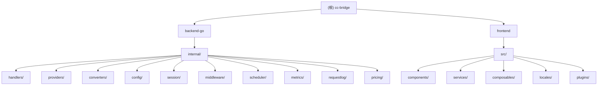

# CLAUDE.md

This file provides guidance to Claude Code (claude.ai/code) when working with code in this repository.

## 项目概述

**CC-Bridge** - 多供应商 AI 代理服务器，支持 OpenAI/Claude 协议转换，提供 Web 管理界面和统一 API 入口。

> Fork 自 [BenedictKing/claude-proxy](https://github.com/BenedictKing/claude-proxy)，个人自用版本。

**技术栈**: Go 1.22 (后端) + Vue 3 + Vuetify (前端) + SQLite (日志) + Docker

## 新增功能（相比上游）

- **🌐 国际化 (i18n)**: 支持 English / 简体中文，语言切换持久化
- **📊 请求日志系统**: SQLite 存储，按模型/供应商统计，自动刷新，日期筛选
- **💰 计费系统**: 基础价格、供应商倍率、模型倍率、Token 类型计费
- **🎨 UI 改进**: 重构头部，改进渠道编排布局，Claude/Codex 图标区分
- **🔧 Codex 支持**: 请求日志同时追踪 Messages API 和 Responses API

## 模块结构图



## 常用命令

```bash
# Go 后端开发（推荐）
cd backend-go
make dev              # 热重载开发模式
make test             # 运行测试
make test-cover       # 测试 + 覆盖率
make build            # 构建生产版本
make lint             # 代码检查
make fmt              # 格式化代码

# 前端开发
cd frontend
bun install && bun run dev

# 根目录快捷命令
make dev              # 前后端联合开发
make build            # 生产构建
make run              # 启动生产服务

# Docker
docker-compose up -d
```

## 架构概览

```
cc-bridge/
├── backend-go/                 # Go 后端
│   ├── main.go                # 入口
│   └── internal/
│       ├── handlers/          # HTTP 处理器 (proxy.go, responses.go, config.go, requestlog_handler.go, pricing.go)
│       ├── providers/         # 上游适配器 (openai.go, claude.go)
│       ├── converters/        # Responses API 协议转换器
│       ├── config/            # 配置管理 + 热重载
│       ├── session/           # Responses API 会话管理
│       ├── middleware/        # 认证、CORS
│       ├── scheduler/         # 多渠道调度器
│       ├── metrics/           # 渠道指标监控
│       ├── requestlog/        # 请求日志 (SQLite)
│       └── pricing/           # 计费系统
└── frontend/                   # Vue 3 + Vuetify 前端
    └── src/
        ├── components/        # Vue 组件 (RequestLogTable.vue, PricingSettings.vue, etc.)
        ├── services/          # API 服务
        ├── composables/       # 组合式函数 (useLocale.ts, useTheme.ts)
        ├── locales/           # 国际化翻译文件 (en.ts, zh-CN.ts)
        └── plugins/           # Vue 插件 (i18n.ts, vuetify.ts)
```

## 模块索引

| 模块 | 路径 | 语言 | 职责 | 文档 |
|------|------|------|------|------|
| **Go 后端** | `backend-go/` | Go 1.22 | 核心代理服务、API 路由、协议转换、日志、计费 | [CLAUDE.md](backend-go/CLAUDE.md) |
| **Vue 前端** | `frontend/` | TypeScript/Vue 3 | Web 管理界面、渠道配置、日志查看 | [CLAUDE.md](frontend/CLAUDE.md) |

## 核心设计模式

1. **Provider Pattern** - `internal/providers/`: 所有上游实现统一 `Provider` 接口
   - `openai.go` - OpenAI 协议适配器
   - `claude.go` - Claude 原生协议
   - `responses.go` - Responses API 专用 Provider

2. **Converter Pattern** - `internal/converters/`: Responses API 的协议转换
   - `factory.go` - 转换器工厂
   - `openai_converter.go` - OpenAI 格式转换
   - `claude_converter.go` - Claude 格式转换
   - `responses_passthrough.go` - 直通模式

3. **Session Manager** - `internal/session/`: 基于 `previous_response_id` 的多轮对话跟踪
   - `manager.go` - 会话生命周期管理
   - `trace_affinity.go` - Trace 亲和性绑定

4. **Scheduler Pattern** - `internal/scheduler/`: 多渠道智能调度
   - `channel_scheduler.go` - 优先级调度、健康检查、自动熔断

5. **Request Log** - `internal/requestlog/`: 请求日志系统
   - `manager.go` - SQLite 存储、查询、统计
   - `types.go` - 日志数据结构

6. **Pricing** - `internal/pricing/`: 计费系统
   - `pricing.go` - 基础价格、倍率计算

## 双 API 支持

- `/v1/messages` - Claude Messages API（支持 OpenAI 协议转换）
- `/v1/responses` - Codex Responses API（支持会话管理）

## 运行与开发

### 开发环境启动
```bash
# 后端热重载
cd backend-go && make dev

# 前端开发服务器
cd frontend && bun run dev
```

### 生产构建
```bash
# 构建所有平台
make build

# 仅构建当前平台
cd backend-go && make build-local
```

### Docker 部署
```bash
docker-compose up -d
```

## 测试策略

### 后端测试
- **单元测试**: `*_test.go` 文件
- **覆盖率**: `make test-cover` 生成 HTML 报告
- **测试文件**:
  - `internal/converters/converter_test.go` - 协议转换测试
  - `internal/middleware/auth_test.go` - 认证中间件测试
  - `internal/utils/*_test.go` - 工具函数测试

### 前端测试
- 暂无自动化测试（手动测试为主）

### 集成测试
- 健康检查: `GET /health`
- API 端点测试: 参考 README.md 中的测试脚本

## 编码规范

- **KISS/DRY/YAGNI** - 保持简洁，消除重复，只实现当前所需
- **命名**:
  - 文件: `kebab-case`
  - Go 类型: `PascalCase`
  - Go 函数: `camelCase`
  - 常量: `SCREAMING_SNAKE_CASE`
  - Vue 组件: `PascalCase.vue`
- **Go**: 使用 `go fmt`，遵循标准 Go 项目布局
- **TypeScript**: 严格类型，避免 `any`
- **提交规范**: 遵循 Conventional Commits

## AI 使用指引

### 代码修改原则
- 优先读取现有代码，理解上下文后再修改
- 保持与现有代码风格一致
- 修改配置文件时注意热重载机制
- 不要修改 `.gitignore` 中的忽略规则

### 常见任务
1. **添加新的上游服务**: 在 `internal/providers/` 实现 `Provider` 接口
2. **修改协议转换**: 编辑 `internal/converters/` 中的转换器
3. **调整调度策略**: 修改 `internal/scheduler/channel_scheduler.go`
4. **前端界面调整**: 编辑 `frontend/src/components/` 中的 Vue 组件
5. **修改计费逻辑**: 编辑 `internal/pricing/pricing.go`
6. **修改日志系统**: 编辑 `internal/requestlog/manager.go`

### 调试技巧
- 后端日志: 查看 `logs/` 目录或控制台输出
- 前端调试: 浏览器开发者工具 + Vue DevTools
- 配置热重载: 修改 `backend-go/.config/config.json` 自动生效
- SQLite 日志: 查看 `backend-go/.config/request_logs.db`

## 重要提示

- **Git 操作**: 未经用户明确要求，不要执行 git commit/push/branch 操作
- **版本更新**: 当用户要求或批准 commit 时，**必须**同时更新 `VERSION` 文件和 `frontend/package.json` 中的版本号（patch 版本 +1），并在 `CHANGELOG.md` 顶部添加对应版本的更新记录
- **配置热重载**: `backend-go/.config/config.json` 修改后自动生效，无需重启
- **认证**: 所有端点（除 `/health`）需要 `x-api-key` 头或 `PROXY_ACCESS_KEY`
- **环境变量**: 通过 `.env` 文件配置，参考 `backend-go/.env.example`

## 文档索引

| 文档 | 内容 |
|------|------|
| [README.md](README.md) | 项目介绍（English）、快速开始、部署指南 |
| [README_CN.md](README_CN.md) | 项目介绍（中文）|
| [ARCHITECTURE.md](ARCHITECTURE.md) | 详细架构、设计模式、数据流 |
| [DEVELOPMENT.md](DEVELOPMENT.md) | 开发流程、调试技巧 |
| [ENVIRONMENT.md](ENVIRONMENT.md) | 环境变量配置 |
| [CONTRIBUTING.md](CONTRIBUTING.md) | 贡献规范 |
| [CHANGELOG.md](CHANGELOG.md) | 版本历史 |
| [backend-go/CLAUDE.md](backend-go/CLAUDE.md) | Go 后端模块文档 |
| [frontend/CLAUDE.md](frontend/CLAUDE.md) | Vue 前端模块文档 |
