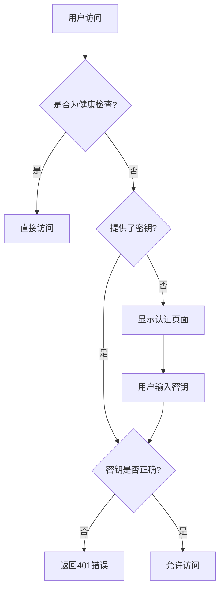

# CC-Bridge

[English](README.md) | [中文](README_CN.md)

[](https://github.com/JillVernus/cc-bridge/releases/latest)
[](https://opensource.org/licenses/MIT)

> **Fork Notice**: This project is forked from [BenedictKing/claude-proxy v2.0.44](https://github.com/BenedictKing/claude-proxy/tree/v2.0.44) under MIT License.
>
> **Disclaimer**: This repository is developed for personal use. Features are added based on personal needs and may not be suitable for all use cases. Use at your own risk.

A high-performance multi-provider AI proxy server supporting OpenAI and Claude and custom APIs with load balancing, multi-API key management, and unified API access.

---

## ✨ New Features (Beyond Upstream)

### 📊 Request Log System
- **Request Log Page**: Full-featured log viewer with SQLite storage
- **Summary Statistics**: View usage by model and by provider
- **Auto-refresh**: Real-time log updates with configurable refresh interval
- **Detailed Logs**: Includes timestamp, model, provider, tokens (input/output/cache read/cache write), cost, duration, status
- **Date Filters**: Filter logs by date range
- **Reset Database**: One-click SQLite reset button in Web UI

### 💰 Pricing System
- **Base Price Model**: Configure base prices for each model
- **Provider Multiplier**: Set price multipliers per provider (e.g., 1.2x for premium providers)
- **Model Multiplier**: Set price multipliers per model
- **Token Type Pricing**: Separate pricing for input/output/cache tokens

### 🎨 UI Improvements
- **Refactored Header**: Gear icon for settings, separate buttons for Messages/Responses provider types, and Log page button
- **Improved Channel Orchestration**: Better button arrangement in failover sequence (故障转移序列), resized provider name space in backup pool (备用资源池)
- **Claude & Codex Icons**: Visual distinction between provider types

### 🔧 Other Enhancements
- **Codex Support in Request Logs**: Track both Claude Messages API and Codex Responses API requests
- **Special Provider Types**: Support for additional provider configurations

---

## 🚀 Core Features (From Upstream)

- **🖥️ All-in-One Architecture**: Backend + Frontend in single container, replaces Nginx
- **🔐 Unified Authentication**: Single key protects all endpoints (Web UI, Admin API, Proxy API)
- **📱 Web Management Panel**: Modern UI for channel management, real-time monitoring
- **Dual API Support**: Claude Messages API (`/v1/messages`) and Codex Responses API (`/v1/responses`)
- **Multi-Provider Support**: OpenAI (and compatible APIs) and Claude
- **🔌 Protocol Conversion**: Automatic conversion between Claude/OpenAI formats
- **🎯 Smart Scheduling**: Priority-based routing, health checks, auto circuit-breaker
- **📊 Channel Orchestration**: Drag-and-drop priority, real-time health status
- **🔄 Trace Affinity**: Same user session binds to same channel
- **Load Balancing**: Round-robin, random, failover strategies
- **Multi API Keys**: Multiple keys per upstream with auto-rotation
- **Auto Retry & Key Degradation**: Auto-switch on quota/balance errors
- **⚡ Auto Circuit-Breaker**: Sliding window health detection, 15-min auto-recovery
- **Hot Reload**: Config changes apply without restart
- **📡 Streaming & Non-streaming**: Full support for both modes
- **🛠️ Tool Calling**: Full tool/function calling support
- **💬 Session Management**: Multi-turn conversation tracking for Responses API

## 🏗️ 架构设计

项目采用一体化架构，单容器部署，完全替代 Nginx：

```
用户 → 后端:3000 →
     ├─ / → 前端界面（需要密钥）
     ├─ /api/* → 管理API（需要密钥）
     ├─ /v1/messages → Claude Messages API 代理（需要密钥）
     └─ /v1/responses → Codex Responses API 代理（需要密钥）
```

**核心优势**: 单端口、统一认证、无跨域问题、资源占用低

> 📚 详细架构设计和技术选型请参考 [ARCHITECTURE.md](ARCHITECTURE.md)

## 🏁 快速开始

### 📋 Prerequisites

**For Docker deployment (Recommended):**
- Docker 20.10+
- Docker Compose v2+ (optional)

**For source build:**
- Go 1.22+
- Bun 1.0+ (or Node.js 18+ with npm)
- Make (optional, for using Makefile commands)
- Git

<details>
<summary>📦 Installation Commands</summary>

**macOS:**
```bash
# Install Homebrew first if not installed
brew install go bun make
```

**Ubuntu/Debian:**
```bash
# Go
wget https://go.dev/dl/go1.22.0.linux-amd64.tar.gz
sudo tar -C /usr/local -xzf go1.22.0.linux-amd64.tar.gz
export PATH=$PATH:/usr/local/go/bin

# Bun
curl -fsSL https://bun.sh/install | bash

# Make
sudo apt install make
```

**Windows:**
```powershell
# Using Chocolatey
choco install golang bun make

# Or using Scoop
scoop install go bun make
```
</details>

---

### 📦 推荐部署方式

| 部署方式       | 启动时间 | 内存占用 | 适用场景           |
| -------------- | -------- | -------- | ------------------ |
| **🐳 Docker**  | ~2s      | ~25MB    | 生产环境、一键部署（推荐） |
| **🚀 源码构建** | <100ms   | ~20MB    | 开发调试、自定义   |

> **Note**: Pre-built executables are not provided. Please use Docker or build from source.

---

### 方式一：🐳 Docker 部署（推荐）

**适合所有用户，无需安装依赖，一键启动**

```bash
# 直接拉取预构建镜像并运行
docker run -d \
  --name cc-bridge \
  -p 3000:3000 \
  -e PROXY_ACCESS_KEY=your-super-strong-secret-key \
  -v $(pwd)/.config:/app/.config \
  ghcr.io/jillvernus/cc-bridge:latest
```

或使用 docker-compose：

```bash
# 1. 克隆项目（仅需 docker-compose.yml）
git clone https://github.com/JillVernus/cc-bridge
cd cc-bridge

# 2. 修改 docker-compose.yml 中的 PROXY_ACCESS_KEY

# 3. 启动服务
docker-compose up -d
```

访问地址：

- **Web 管理界面**: http://localhost:3000
- **Messages API 端点**: http://localhost:3000/v1/messages
- **Responses API 端点**: http://localhost:3000/v1/responses
- **健康检查**: http://localhost:3000/health

---

### 方式二：🚀 源码构建部署

**适合追求极致性能或需要自定义的用户**

```bash
# 1. 克隆项目
git clone https://github.com/JillVernus/cc-bridge
cd cc-bridge

# 2. 配置环境变量
cp backend-go/.env.example backend-go/.env
# 编辑 backend-go/.env 文件，设置你的配置

# 3. 启动服务
make run           # 普通用户运行（推荐）
# 或 make dev       # 开发调试（热重载）
# 或 make help      # 查看所有命令
```

**快捷命令说明：**

```bash
make run           # 普通用户运行（自动构建前端并启动后端）
make dev           # 开发调试（后端热重载）
make help          # 查看所有可用命令
```

> 📚 更多配置管理命令详见 `make help`

> 🪟 **Windows 用户**: 如果遇到 `make` 或 `vite` 命令找不到的问题，请参考 [DEVELOPMENT.md#windows-环境配置](DEVELOPMENT.md#-windows-环境配置)

---

## 🐳 Docker 部署详细配置

### 镜像地址

预构建镜像托管在 GitHub Container Registry：

```
ghcr.io/jillvernus/cc-bridge:latest
```

支持 `linux/amd64` 和 `linux/arm64` 架构。

### 自定义部署（本地构建）

如需自定义或二次开发，可使用本地构建：

```yaml
# docker-compose.yml
services:
  cc-bridge:
    build:
      context: .
      dockerfile: Dockerfile  # 国内网络使用 Dockerfile_China
    container_name: cc-bridge
    ports:
      - '3000:3000' # 统一端口
    environment:
      - ENV=production
      - ENABLE_WEB_UI=true # true=一体化, false=纯API
      - PROXY_ACCESS_KEY=your-super-strong-secret-key
      - LOG_LEVEL=info
    volumes:
      - ./.config:/app/.config # 配置持久化
      - ./logs:/app/logs # 日志持久化
    restart: unless-stopped
```

### 云平台一键部署

#### Railway 部署

```bash
# 1. 连接 GitHub 仓库到 Railway
# 2. 设置环境变量
PROXY_ACCESS_KEY=your-super-strong-secret-key
ENABLE_WEB_UI=true
ENV=production
PORT=3000

# 3. 自动部署完成
# 访问：https://your-app.railway.app
```

#### Render 部署

```bash
# 1. 选择 Docker 服务类型
# 2. 连接 GitHub 仓库
# 3. 设置环境变量：
#    PROXY_ACCESS_KEY=your-super-strong-secret-key
#    ENABLE_WEB_UI=true
#    ENV=production
# 4. 自动构建和部署
```

#### Fly.io 部署

```bash
# 快速部署
fly launch --dockerfile Dockerfile
fly secrets set PROXY_ACCESS_KEY=your-super-strong-secret-key
fly secrets set ENABLE_WEB_UI=true
fly deploy

# 查看状态
fly status
fly logs
```

#### Zeabur 部署

```bash
# 1. 连接 GitHub 仓库
# 2. 自动检测 Docker 项目
# 3. 设置环境变量
# 4. 一键部署
```

## 🔧 配置管理

**两种配置方式**:

1. **Web 界面** (推荐): 访问 `http://localhost:3000` → 输入密钥 → 可视化管理
2. **命令行工具**: `cd backend-go && make help`

> 📚 环境变量配置详见 [ENVIRONMENT.md](ENVIRONMENT.md)

## 🔐 安全配置

### 统一访问控制

所有访问入口均受 `PROXY_ACCESS_KEY` 保护：

1. **前端管理界面** (`/`) - 通过查询参数或本地存储验证密钥
2. **管理 API** (`/api/*`) - 需要 `x-api-key` 请求头
3. **代理 API** (`/v1/messages`) - 需要 `x-api-key` 请求头
4. **健康检查** (`/health`) - 公开访问，无需密钥

### 认证流程



### 生产环境安全清单

```bash
# 1. 生成强密钥 (必须!)
PROXY_ACCESS_KEY=$(openssl rand -base64 32)
echo "生成的密钥: $PROXY_ACCESS_KEY"

# 2. 生产环境配置
ENV=production
ENABLE_REQUEST_LOGS=false
ENABLE_RESPONSE_LOGS=false
LOG_LEVEL=warn
ENABLE_WEB_UI=true

# 3. 网络安全
# - 使用 HTTPS (推荐 Cloudflare CDN)
# - 配置防火墙规则
# - 定期轮换访问密钥
# - 启用访问日志监控
```

### 密钥管理最佳实践

```bash
# 密钥轮换
echo "旧密钥: $OLD_PROXY_ACCESS_KEY"
echo "新密钥: $NEW_PROXY_ACCESS_KEY"

# 更新环境变量
export PROXY_ACCESS_KEY=$NEW_PROXY_ACCESS_KEY

# 重启服务
docker-compose restart cc-bridge
```

## 📖 API 使用

本服务支持两种 API 格式：

1. **Messages API** (`/v1/messages`) - 标准的 Claude API 格式
2. **Responses API** (`/v1/responses`) - Codex 格式，支持会话管理

### Messages API - 标准 Claude API 调用

```bash
curl -X POST http://localhost:3000/v1/messages \
  -H "x-api-key: your-proxy-access-key" \
  -H "Content-Type: application/json" \
  -d '{
    "model": "claude-3-5-sonnet-20241022",
    "max_tokens": 100,
    "messages": [
      {"role": "user", "content": "Hello!"}
    ]
  }'
```

### 流式响应

```bash
curl -X POST http://localhost:3000/v1/messages \
  -H "x-api-key: your-proxy-access-key" \
  -H "Content-Type: application/json" \
  -d '{
    "model": "claude-3-5-sonnet-20241022",
    "stream": true,
    "max_tokens": 100,
    "messages": [
      {"role": "user", "content": "Count to 10"}
    ]
  }'
```

### 工具调用

```bash
curl -X POST http://localhost:3000/v1/messages \
  -H "x-api-key: your-proxy-access-key" \
  -H "Content-Type: application/json" \
  -d '{
    "model": "claude-3-5-sonnet-20241022",
    "max_tokens": 1000,
    "tools": [
      {
        "name": "get_weather",
        "description": "获取指定城市的天气信息",
        "input_schema": {
          "type": "object",
          "properties": {
            "city": {"type": "string", "description": "城市名称"}
          },
          "required": ["city"]
        }
      }
    ],
    "messages": [
      {"role": "user", "content": "北京今天天气怎么样？"}
    ]
  }'
```

### Responses API - Codex 格式调用

Responses API 支持会话管理和多轮对话，自动跟踪上下文：

#### 基础调用

```bash
curl -X POST http://localhost:3000/v1/responses \
  -H "x-api-key: your-proxy-access-key" \
  -H "Content-Type: application/json" \
  -d '{
    "model": "gpt-5",
    "max_tokens": 100,
    "input": "你好！请介绍一下你自己。"
  }'
```

#### 多轮对话（会话跟踪）

```bash
# 第一轮对话
RESPONSE_ID=$(curl -s -X POST http://localhost:3000/v1/responses \
  -H "x-api-key: your-proxy-access-key" \
  -H "Content-Type: application/json" \
  -d '{
    "model": "gpt-5",
    "max_tokens": 100,
    "input": "我的名字是张三"
  }' | jq -r '.id')

# 第二轮对话（基于上一轮）
curl -X POST http://localhost:3000/v1/responses \
  -H "x-api-key: your-proxy-access-key" \
  -H "Content-Type: application/json" \
  -d "{
    \"model\": \"gpt-5\",
    \"max_tokens\": 100,
    \"input\": \"你还记得我的名字吗？\",
    \"previous_response_id\": \"$RESPONSE_ID\"
  }"
```

#### 流式响应

```bash
curl -X POST http://localhost:3000/v1/responses \
  -H "x-api-key: your-proxy-access-key" \
  -H "Content-Type: application/json" \
  -d '{
    "model": "gpt-5",
    "stream": true,
    "max_tokens": 200,
    "input": "从1数到10"
  }'
```

#### 会话参数说明

- **`input`**: 用户输入（字符串或数组）
- **`previous_response_id`**: 上一轮响应的 ID，用于多轮对话
- **`store`**: 是否存储会话（默认 `true`）
- **`stream`**: 是否启用流式响应（默认 `false`）
- **响应字段**:
  - `id`: 响应 ID（用于下一轮对话）
  - `previous_id`: 上一轮响应 ID
  - `output`: 模型输出内容
  - `usage`: Token 使用统计

### 管理 API

```bash
# 获取渠道列表
curl -H "x-api-key: your-proxy-access-key" \
  http://localhost:3000/api/channels

# 测试渠道连通性
curl -H "x-api-key: your-proxy-access-key" \
  http://localhost:3000/api/ping
```

## 🔌 协议转换能力

### Messages API 多协议支持

本代理服务器的 Messages API 端点 (`/v1/messages`) 支持多种上游协议转换：

**支持的上游服务**:

- ✅ **Claude API** (Anthropic) - 原生支持，直接透传
- ✅ **OpenAI API** - 自动转换 Claude 格式 ↔ OpenAI 格式
- ✅ **OpenAI 兼容 API** - 支持所有兼容 OpenAI 格式的服务

**核心优势**:

- 🔄 **统一接口**: 客户端只需使用 Claude Messages API 格式
- 🎯 **自动转换**: 代理自动处理不同上游的协议差异
- 🔌 **即插即用**: 无需修改客户端代码即可切换上游服务
- 💰 **成本优化**: 灵活切换不同价格的 AI 服务

**示例**: 使用 Claude API 格式调用 OpenAI GPT-4

```bash
curl -X POST http://localhost:3000/v1/messages \
  -H "x-api-key: your-proxy-access-key" \
  -H "Content-Type: application/json" \
  -d '{
    "model": "claude-3-5-sonnet-20241022",
    "max_tokens": 100,
    "messages": [
      {"role": "user", "content": "Hello!"}
    ]
  }'
# 后端自动转换并发送到配置的 OpenAI 上游
```

## 🧪 测试验证

### 快速验证脚本

创建 `test-proxy.sh` 测试脚本：

```bash
#!/bin/bash
set -e

PROXY_URL="http://localhost:3000"
API_KEY="your-proxy-access-key"

echo "🏥 测试健康检查..."
curl -s "$PROXY_URL/health" | jq .

echo "\n🔒 测试无密钥访问 (应该失败)..."
curl -s "$PROXY_URL/api/channels" || echo "✅ 正确拒绝无密钥访问"

echo "\n🔑 测试API访问 (应该成功)..."
curl -s -H "x-api-key: $API_KEY" "$PROXY_URL/api/channels" | jq .

echo "\n💬 测试Claude API代理..."
curl -s -X POST "$PROXY_URL/v1/messages" \
  -H "x-api-key: $API_KEY" \
  -H "Content-Type: application/json" \
  -d '{
    "model": "claude-3-5-sonnet-20241022",
    "max_tokens": 50,
    "messages": [{"role": "user", "content": "Hello"}]
  }' | jq .

echo "\n✅ 所有测试完成！"
```

```bash
# 运行测试
chmod +x test-proxy.sh
./test-proxy.sh
```

### 集成测试

```bash
# Claude Code CLI 集成测试
# 1. 配置 Claude Code 使用本地代理
export ANTHROPIC_API_URL="http://localhost:3000"
export ANTHROPIC_API_KEY="your-proxy-access-key"

# 2. 测试基础对话
echo "测试Claude Code集成..." | claude-code

# 3. 测试工具调用
echo "请帮我查看当前目录的文件" | claude-code
```

## 📊 监控和日志

### 健康检查

```bash
# 健康检查端点 (无需认证)
GET /health

# 返回示例
{
  "status": "healthy",
  "timestamp": "2024-01-01T00:00:00.000Z",
  "uptime": 3600,
  "mode": "production",
  "config": {
    "upstreamCount": 3,
    "loadBalance": "round-robin"
  }
}
```

### 服务状态监控

```bash
# Docker 容器状态
docker-compose ps
docker-compose logs -f cc-bridge

# 性能监控
docker stats cc-bridge

# 存储使用
du -sh .config/ logs/
```

### 日志级别

```bash
LOG_LEVEL=debug  # debug, info, warn, error
ENABLE_REQUEST_LOGS=true   # 记录请求日志
ENABLE_RESPONSE_LOGS=true  # 记录响应日志
```

## 🔧 故障排除

### 常见问题

1. **认证失败**

   ```bash
   # 检查密钥设置
   echo $PROXY_ACCESS_KEY

   # 验证密钥格式
   curl -H "x-api-key: $PROXY_ACCESS_KEY" http://localhost:3000/health
   ```

2. **容器启动失败**

   ```bash
   # 检查日志
   docker-compose logs cc-bridge

   # 检查端口占用
   lsof -i :3000
   ```

3. **前端界面无法访问 - "前端资源未找到"**

   **原因**: 前端构建产物不存在或路径不正确

   **解决方案**:

   ```bash
   # 方案1: 重新构建（推荐）
   make build-current
   cd backend-go && ./dist/cc-bridge

   # 方案2: 验证构建产物是否存在
   ls -la frontend/dist/index.html

   # 方案3: 临时禁用Web UI
   # 编辑 backend-go/.env 文件
   ENABLE_WEB_UI=false
   # 然后只使用API端点: /v1/messages
   ```

4. **Docker 环境前端 404**

   ```bash
   # 检查 ENABLE_WEB_UI 设置
   docker-compose exec cc-bridge printenv ENABLE_WEB_UI

   # 检查文件路径（Docker内部会自动复制到正确位置）
   docker-compose exec cc-bridge ls -la /app/frontend/dist/

   # 重新构建镜像
   docker-compose build --no-cache
   docker-compose up -d
   ```

### 重置配置

```bash
# 停止服务
docker-compose down

# 清理配置文件
rm -rf .config/*

# 重新启动
docker-compose up -d
```

## 🔄 更新升级

```bash
# 获取最新代码
git pull origin main

# 重新构建并启动
docker-compose up -d --build
```

## 🔧 CI/CD 自动化

项目配置了 GitHub Actions 自动化流程：

### 自动发布 (推送 tag 触发)

| Workflow | 说明 |
|----------|------|
| `docker-build.yml` | 构建多平台 Docker 镜像 (阿里云 ACR) |

> **Note**: Pre-built executables are not provided. Only Docker images are automatically built.

### 发布新版本

```bash
# 1. 更新版本号
echo "vX.Y.Z" > VERSION

# 2. 提交并打 tag
git add . && git commit -m "chore: bump version to vX.Y.Z"
git tag vX.Y.Z
git push origin main --tags
```

## 📖 使用指南

### 命令行配置工具

```bash
cd backend-go && make help
```

### 相关文档

- **📐 架构设计**: [ARCHITECTURE.md](ARCHITECTURE.md) - 技术选型、设计模式、数据流
- **⚙️ 环境配置**: [ENVIRONMENT.md](ENVIRONMENT.md) - 环境变量、配置场景、故障排除
- **🔨 开发指南**: [DEVELOPMENT.md](DEVELOPMENT.md) - 开发流程、调试技巧、最佳实践
- **🤝 贡献规范**: [CONTRIBUTING.md](CONTRIBUTING.md) - 提交规范、代码质量标准
- **📝 版本历史**: [CHANGELOG.md](CHANGELOG.md) - 完整变更记录和升级指南
- **🚀 发布流程**: [RELEASE.md](RELEASE.md) - 维护者发布流程

## 📄 许可证

本项目基于 MIT 许可证开源 - 查看 [LICENSE](LICENSE) 文件了解详情。

## 🙏 致谢

- [BenedictKing/claude-proxy](https://github.com/BenedictKing/claude-proxy) - 上游项目
- [Anthropic](https://www.anthropic.com/) - Claude API
- [OpenAI](https://openai.com/) - GPT API
