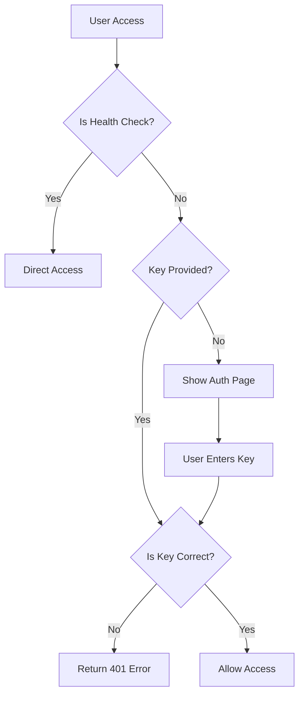

# CC-Bridge

[English](README.md) | [中文](README_CN.md)

[](https://github.com/JillVernus/cc-bridge/releases/latest)
[](https://opensource.org/licenses/MIT)
[](https://github.com/JillVernus/cc-bridge/pkgs/container/cc-bridge)

> **Fork Notice**: This project is forked from [BenedictKing/claude-proxy v2.0.44](https://github.com/BenedictKing/claude-proxy/tree/v2.0.44) under MIT License.
>
> **Disclaimer**: This repository is developed for personal use. Features are added based on personal needs and may not be suitable for all use cases. Use at your own risk.

A high-performance multi-provider AI proxy server supporting OpenAI and Claude and custom APIs with load balancing, multi-API key management, and unified API access.

---

## ✨ New Features (Beyond Upstream)

### 📊 Request Log System
- **Request Log Page**: Full-featured log viewer with SQLite storage
- **Summary Statistics**: View usage by model and by provider
- **Auto-refresh**: Real-time log updates with configurable refresh interval
- **Detailed Logs**: Includes timestamp, model, provider, tokens (input/output/cache read/cache write), cost, duration, status
- **Date Filters**: Filter logs by date range
- **Reset Database**: One-click SQLite reset button in Web UI

### 💰 Pricing System
- **Base Price Model**: Configure base prices for each model
- **Provider Multiplier**: Set price multipliers per provider (e.g., 1.2x for premium providers)
- **Model Multiplier**: Set price multipliers per model
- **Token Type Pricing**: Separate pricing for input/output/cache tokens

### 🎨 UI Improvements
- **Refactored Header**: Gear icon for settings, separate buttons for Messages/Responses provider types, and Log page button
- **Improved Channel Orchestration**: Better button arrangement in failover sequence (故障转移序列), resized provider name space in backup pool (备用资源池)
- **Claude & Codex Icons**: Visual distinction between provider types

### 🔧 Other Enhancements
- **Codex Support in Request Logs**: Track both Claude Messages API and Codex Responses API requests
- **Special Provider Types**: Support for additional provider configurations

---

## 🚀 Core Features (From Upstream)

- **🖥️ All-in-One Architecture**: Backend + Frontend in single container, replaces Nginx
- **🔐 Unified Authentication**: Single key protects all endpoints (Web UI, Admin API, Proxy API)
- **📱 Web Management Panel**: Modern UI for channel management, real-time monitoring
- **Dual API Support**: Claude Messages API (`/v1/messages`) and Codex Responses API (`/v1/responses`)
- **Multi-Provider Support**: OpenAI (and compatible APIs) and Claude
- **🔌 Protocol Conversion**: Automatic conversion between Claude/OpenAI formats
- **🎯 Smart Scheduling**: Priority-based routing, health checks, auto circuit-breaker
- **📊 Channel Orchestration**: Drag-and-drop priority, real-time health status
- **🔄 Trace Affinity**: Same user session binds to same channel
- **Load Balancing**: Round-robin, random, failover strategies
- **Multi API Keys**: Multiple keys per upstream with auto-rotation
- **Auto Retry & Key Degradation**: Auto-switch on quota/balance errors
- **⚡ Auto Circuit-Breaker**: Sliding window health detection, 15-min auto-recovery
- **Hot Reload**: Config changes apply without restart
- **📡 Streaming & Non-streaming**: Full support for both modes
- **🛠️ Tool Calling**: Full tool/function calling support
- **💬 Session Management**: Multi-turn conversation tracking for Responses API

## 🏗️ Architecture

The project uses an all-in-one architecture with single container deployment, completely replacing Nginx:

```
User → Backend:3000 →
     ├─ / → Frontend UI (requires key)
     ├─ /api/* → Admin API (requires key)
     ├─ /v1/messages → Claude Messages API Proxy (requires key)
     └─ /v1/responses → Codex Responses API Proxy (requires key)
```

**Core Advantages**: Single port, unified authentication, no CORS issues, low resource usage

> 📚 For detailed architecture design and technical choices, see [ARCHITECTURE.md](ARCHITECTURE.md)

## 🏁 Quick Start

### 📋 Prerequisites

**For Docker deployment (Recommended):**
- Docker 20.10+
- Docker Compose v2+ (optional)

**For source build:**
- Go 1.22+
- Bun 1.0+ (or Node.js 18+ with npm)
- Make (optional, for using Makefile commands)
- Git

<details>
<summary>📦 Installation Commands</summary>

**macOS:**
```bash
# Install Homebrew first if not installed
brew install go bun make
```

**Ubuntu/Debian:**
```bash
# Go
wget https://go.dev/dl/go1.22.0.linux-amd64.tar.gz
sudo tar -C /usr/local -xzf go1.22.0.linux-amd64.tar.gz
export PATH=$PATH:/usr/local/go/bin

# Bun
curl -fsSL https://bun.sh/install | bash

# Make
sudo apt install make
```

**Windows:**
```powershell
# Using Chocolatey
choco install golang bun make

# Or using Scoop
scoop install go bun make
```
</details>

---

### 📦 Recommended Deployment Methods

| Method | Startup Time | Memory | Use Case |
| ------ | ------------ | ------ | -------- |
| **🐳 Docker** | ~2s | ~25MB | Production, one-click deploy (Recommended) |
| **🚀 Source Build** | <100ms | ~20MB | Development, customization |

> **Note**: Pre-built executables are not provided. Please use Docker or build from source.

---

### Option 1: 🐳 Docker Deployment (Recommended)

**Suitable for all users, no dependencies required, one-click start**

#### Pull and Run Directly (Simplest)

```bash
# Pull and run the latest version
docker run -d \
  --name cc-bridge \
  -p 3000:3000 \
  -e PROXY_ACCESS_KEY=your-super-strong-secret-key \
  -v $(pwd)/.config:/app/.config \
  ghcr.io/jillvernus/cc-bridge:latest
```

**Available Image Tags:**

| Tag | Description |
|-----|-------------|
| `latest` | Latest stable version |
| `v1.0.0`, `v1.0.1`, ... | Specific version number |

```bash
# Use a specific version
docker pull ghcr.io/jillvernus/cc-bridge:v1.0.1

# View available tags
# https://github.com/JillVernus/cc-bridge/pkgs/container/cc-bridge
```

#### Using docker-compose

```bash
# 1. Create docker-compose.yml (or clone the project)
git clone https://github.com/JillVernus/cc-bridge
cd cc-bridge

# 2. Edit PROXY_ACCESS_KEY in docker-compose.yml

# 3. Start the service
docker-compose up -d
```

Access URLs:

- **Web Management Panel**: http://localhost:3000
- **Messages API Endpoint**: http://localhost:3000/v1/messages
- **Responses API Endpoint**: http://localhost:3000/v1/responses
- **Health Check**: http://localhost:3000/health

---

### Option 2: 🚀 Build from Source

**For users seeking maximum performance or customization**

```bash
# 1. Clone the project
git clone https://github.com/JillVernus/cc-bridge
cd cc-bridge

# 2. Configure environment variables
cp backend-go/.env.example backend-go/.env
# Edit backend-go/.env file to set your configuration

# 3. Start the service
make run           # Normal run (recommended)
# or make dev       # Development mode (hot reload)
# or make help      # View all commands
```

**Command Reference:**

```bash
make run           # Normal run (auto-build frontend and start backend)
make dev           # Development mode (backend hot reload)
make help          # View all available commands
```

> 📚 See `make help` for more configuration commands

> 🪟 **Windows Users**: If you encounter issues with `make` or `vite` commands not found, see [DEVELOPMENT.md#windows-environment-setup](DEVELOPMENT.md#-windows-environment-setup)

---

## 🐳 Docker Deployment Details

### Image Location

Pre-built images are hosted on GitHub Container Registry:

```bash
# Image address
ghcr.io/jillvernus/cc-bridge:latest

# Pull image
docker pull ghcr.io/jillvernus/cc-bridge:latest

# Pull specific version
docker pull ghcr.io/jillvernus/cc-bridge:v1.0.1
```

**Available Tags:**
- `latest` - Latest stable version (Recommended)
- `vX.Y.Z` - Specific version number (e.g., `v1.0.0`, `v1.0.1`)

**Supported Architectures:** `linux/amd64`, `linux/arm64`

**Image Repository:** https://github.com/JillVernus/cc-bridge/pkgs/container/cc-bridge

### Custom Deployment (Local Build)

For customization or development, use local build:

```yaml
# docker-compose.yml
services:
  cc-bridge:
    build:
      context: .
      dockerfile: Dockerfile  # Use Dockerfile_China for China network
    container_name: cc-bridge
    ports:
      - '3000:3000' # Unified port
    environment:
      - ENV=production
      - ENABLE_WEB_UI=true # true=all-in-one, false=API only
      - PROXY_ACCESS_KEY=your-super-strong-secret-key
      - LOG_LEVEL=info
    volumes:
      - ./.config:/app/.config # Config persistence
      - ./logs:/app/logs # Log persistence
    restart: unless-stopped
```

### Cloud Platform Deployment

#### Railway Deployment

```bash
# 1. Connect GitHub repository to Railway
# 2. Set environment variables
PROXY_ACCESS_KEY=your-super-strong-secret-key
ENABLE_WEB_UI=true
ENV=production
PORT=3000

# 3. Auto deployment complete
# Access: https://your-app.railway.app
```

#### Render Deployment

```bash
# 1. Select Docker service type
# 2. Connect GitHub repository
# 3. Set environment variables:
#    PROXY_ACCESS_KEY=your-super-strong-secret-key
#    ENABLE_WEB_UI=true
#    ENV=production
# 4. Auto build and deploy
```

#### Fly.io Deployment

```bash
# Quick deploy
fly launch --dockerfile Dockerfile
fly secrets set PROXY_ACCESS_KEY=your-super-strong-secret-key
fly secrets set ENABLE_WEB_UI=true
fly deploy

# Check status
fly status
fly logs
```

#### Zeabur Deployment

```bash
# 1. Connect GitHub repository
# 2. Auto-detect Docker project
# 3. Set environment variables
# 4. One-click deploy
```

## 🔧 Configuration

**Two configuration methods**:

1. **Web Interface** (Recommended): Visit `http://localhost:3000` → Enter key → Visual management
2. **Command Line Tool**: `cd backend-go && make help`

> 📚 For environment variable configuration, see [ENVIRONMENT.md](ENVIRONMENT.md)

## 🔐 Security Configuration

### Unified Access Control

All access points are protected by `PROXY_ACCESS_KEY`:

1. **Frontend Management Panel** (`/`) - Validates key via query parameter or local storage
2. **Admin API** (`/api/*`) - Requires `x-api-key` header
3. **Proxy API** (`/v1/messages`) - Requires `x-api-key` header
4. **Health Check** (`/health`) - Public access, no key required

### Authentication Flow



### Production Security Checklist

```bash
# 1. Generate strong key (Required!)
PROXY_ACCESS_KEY=$(openssl rand -base64 32)
echo "Generated key: $PROXY_ACCESS_KEY"

# 2. Production configuration
ENV=production
ENABLE_REQUEST_LOGS=false
ENABLE_RESPONSE_LOGS=false
LOG_LEVEL=warn
ENABLE_WEB_UI=true

# 3. Network security
# - Use HTTPS (Cloudflare CDN recommended)
# - Configure firewall rules
# - Rotate access keys regularly
# - Enable access log monitoring
```

### Key Management Best Practices

```bash
# Key rotation
echo "Old key: $OLD_PROXY_ACCESS_KEY"
echo "New key: $NEW_PROXY_ACCESS_KEY"

# Update environment variable
export PROXY_ACCESS_KEY=$NEW_PROXY_ACCESS_KEY

# Restart service
docker-compose restart cc-bridge
```

## 📖 API Usage

This service supports two API formats:

1. **Messages API** (`/v1/messages`) - Standard Claude API format
2. **Responses API** (`/v1/responses`) - Codex format with session management

### Messages API - Standard Claude API Call

```bash
curl -X POST http://localhost:3000/v1/messages \
  -H "x-api-key: your-proxy-access-key" \
  -H "Content-Type: application/json" \
  -d '{
    "model": "claude-3-5-sonnet-20241022",
    "max_tokens": 100,
    "messages": [
      {"role": "user", "content": "Hello!"}
    ]
  }'
```

### Streaming Response

```bash
curl -X POST http://localhost:3000/v1/messages \
  -H "x-api-key: your-proxy-access-key" \
  -H "Content-Type: application/json" \
  -d '{
    "model": "claude-3-5-sonnet-20241022",
    "stream": true,
    "max_tokens": 100,
    "messages": [
      {"role": "user", "content": "Count to 10"}
    ]
  }'
```

### Tool Calling

```bash
curl -X POST http://localhost:3000/v1/messages \
  -H "x-api-key: your-proxy-access-key" \
  -H "Content-Type: application/json" \
  -d '{
    "model": "claude-3-5-sonnet-20241022",
    "max_tokens": 1000,
    "tools": [
      {
        "name": "get_weather",
        "description": "Get weather info for a specified city",
        "input_schema": {
          "type": "object",
          "properties": {
            "city": {"type": "string", "description": "City name"}
          },
          "required": ["city"]
        }
      }
    ],
    "messages": [
      {"role": "user", "content": "What is the weather like in Beijing today?"}
    ]
  }'
```

### Responses API - Codex Format Call

Responses API supports session management and multi-turn conversations with automatic context tracking:

#### Basic Call

```bash
curl -X POST http://localhost:3000/v1/responses \
  -H "x-api-key: your-proxy-access-key" \
  -H "Content-Type: application/json" \
  -d '{
    "model": "gpt-5",
    "max_tokens": 100,
    "input": "Hello! Please introduce yourself."
  }'
```

#### Multi-turn Conversation (Session Tracking)

```bash
# First turn
RESPONSE_ID=$(curl -s -X POST http://localhost:3000/v1/responses \
  -H "x-api-key: your-proxy-access-key" \
  -H "Content-Type: application/json" \
  -d '{
    "model": "gpt-5",
    "max_tokens": 100,
    "input": "My name is John"
  }' | jq -r '.id')

# Second turn (based on previous)
curl -X POST http://localhost:3000/v1/responses \
  -H "x-api-key: your-proxy-access-key" \
  -H "Content-Type: application/json" \
  -d "{
    \"model\": \"gpt-5\",
    \"max_tokens\": 100,
    \"input\": \"Do you remember my name?\",
    \"previous_response_id\": \"$RESPONSE_ID\"
  }"
```

#### Streaming Response

```bash
curl -X POST http://localhost:3000/v1/responses \
  -H "x-api-key: your-proxy-access-key" \
  -H "Content-Type: application/json" \
  -d '{
    "model": "gpt-5",
    "stream": true,
    "max_tokens": 200,
    "input": "Count from 1 to 10"
  }'
```

#### Session Parameters

- **`input`**: User input (string or array)
- **`previous_response_id`**: Previous response ID for multi-turn conversations
- **`store`**: Whether to store session (default `true`)
- **`stream`**: Enable streaming response (default `false`)
- **Response fields**:
  - `id`: Response ID (for next turn)
  - `previous_id`: Previous response ID
  - `output`: Model output content
  - `usage`: Token usage statistics

### Admin API

```bash
# Get channel list
curl -H "x-api-key: your-proxy-access-key" \
  http://localhost:3000/api/channels

# Test channel connectivity
curl -H "x-api-key: your-proxy-access-key" \
  http://localhost:3000/api/ping
```

## 🔌 Protocol Conversion

### Messages API Multi-Protocol Support

The Messages API endpoint (`/v1/messages`) of this proxy server supports multiple upstream protocol conversions:

**Supported Upstream Services**:

- ✅ **Claude API** (Anthropic) - Native support, direct passthrough
- ✅ **OpenAI API** - Auto-convert Claude format ↔ OpenAI format
- ✅ **OpenAI Compatible APIs** - Support all OpenAI-compatible services

**Core Advantages**:

- 🔄 **Unified Interface**: Clients only need to use Claude Messages API format
- 🎯 **Auto Conversion**: Proxy automatically handles protocol differences
- 🔌 **Plug and Play**: Switch upstream services without modifying client code
- 💰 **Cost Optimization**: Flexibly switch between different priced AI services

**Example**: Using Claude API format to call OpenAI GPT-4

```bash
curl -X POST http://localhost:3000/v1/messages \
  -H "x-api-key: your-proxy-access-key" \
  -H "Content-Type: application/json" \
  -d '{
    "model": "claude-3-5-sonnet-20241022",
    "max_tokens": 100,
    "messages": [
      {"role": "user", "content": "Hello!"}
    ]
  }'
# Backend auto-converts and sends to configured OpenAI upstream
```

## 🧪 Testing

### Quick Verification Script

Create `test-proxy.sh` test script:

```bash
#!/bin/bash
set -e

PROXY_URL="http://localhost:3000"
API_KEY="your-proxy-access-key"

echo "🏥 Testing health check..."
curl -s "$PROXY_URL/health" | jq .

echo "\n🔒 Testing access without key (should fail)..."
curl -s "$PROXY_URL/api/channels" || echo "✅ Correctly rejected keyless access"

echo "\n🔑 Testing API access (should succeed)..."
curl -s -H "x-api-key: $API_KEY" "$PROXY_URL/api/channels" | jq .

echo "\n💬 Testing Claude API proxy..."
curl -s -X POST "$PROXY_URL/v1/messages" \
  -H "x-api-key: $API_KEY" \
  -H "Content-Type: application/json" \
  -d '{
    "model": "claude-3-5-sonnet-20241022",
    "max_tokens": 50,
    "messages": [{"role": "user", "content": "Hello"}]
  }' | jq .

echo "\n✅ All tests completed!"
```

```bash
# Run tests
chmod +x test-proxy.sh
./test-proxy.sh
```

### Integration Testing

```bash
# Claude Code CLI integration test
# 1. Configure Claude Code to use local proxy
export ANTHROPIC_API_URL="http://localhost:3000"
export ANTHROPIC_API_KEY="your-proxy-access-key"

# 2. Test basic conversation
echo "Testing Claude Code integration..." | claude-code

# 3. Test tool calling
echo "Please list the files in the current directory" | claude-code
```

## 📊 Monitoring and Logging

### Health Check

```bash
# Health check endpoint (no auth required)
GET /health

# Response example
{
  "status": "healthy",
  "timestamp": "2024-01-01T00:00:00.000Z",
  "uptime": 3600,
  "mode": "production",
  "config": {
    "upstreamCount": 3,
    "loadBalance": "round-robin"
  }
}
```

### Service Status Monitoring

```bash
# Docker container status
docker-compose ps
docker-compose logs -f cc-bridge

# Performance monitoring
docker stats cc-bridge

# Storage usage
du -sh .config/ logs/
```

### Log Levels

```bash
LOG_LEVEL=debug  # debug, info, warn, error
ENABLE_REQUEST_LOGS=true   # Enable request logging
ENABLE_RESPONSE_LOGS=true  # Enable response logging
```

## 🔧 Troubleshooting

### Common Issues

1. **Authentication Failed**

   ```bash
   # Check key settings
   echo $PROXY_ACCESS_KEY

   # Verify key format
   curl -H "x-api-key: $PROXY_ACCESS_KEY" http://localhost:3000/health
   ```

2. **Container Startup Failed**

   ```bash
   # Check logs
   docker-compose logs cc-bridge

   # Check port usage
   lsof -i :3000
   ```

3. **Frontend Cannot Be Accessed - "Frontend resources not found"**

   **Cause**: Frontend build artifacts don't exist or path is incorrect

   **Solution**:

   ```bash
   # Option 1: Rebuild (recommended)
   make build-current
   cd backend-go && ./dist/cc-bridge

   # Option 2: Verify build artifacts exist
   ls -la frontend/dist/index.html

   # Option 3: Temporarily disable Web UI
   # Edit backend-go/.env file
   ENABLE_WEB_UI=false
   # Then only use API endpoint: /v1/messages
   ```

4. **Docker Frontend 404**

   ```bash
   # Check ENABLE_WEB_UI setting
   docker-compose exec cc-bridge printenv ENABLE_WEB_UI

   # Check file paths (Docker auto-copies to correct location)
   docker-compose exec cc-bridge ls -la /app/frontend/dist/

   # Rebuild image
   docker-compose build --no-cache
   docker-compose up -d
   ```

### Reset Configuration

```bash
# Stop service
docker-compose down

# Clean config files
rm -rf .config/*

# Restart
docker-compose up -d
```

## 🔄 Updates and Upgrades

```bash
# Get latest code
git pull origin main

# Rebuild and start
docker-compose up -d --build
```

## 🔧 CI/CD Automation

The project has GitHub Actions automation workflows configured:

### Auto Release (Triggered by tag push)

| Workflow | Description |
|----------|-------------|
| `docker-build.yml` | Build multi-platform Docker images (Aliyun ACR) |

> **Note**: Pre-built executables are not provided. Only Docker images are automatically built.

### Release New Version

```bash
# 1. Update version number
echo "vX.Y.Z" > VERSION

# 2. Commit and tag
git add . && git commit -m "chore: bump version to vX.Y.Z"
git tag vX.Y.Z
git push origin main --tags
```

## 📖 Documentation

### Command Line Configuration Tool

```bash
cd backend-go && make help
```

### Related Documentation

- **📐 Architecture**: [ARCHITECTURE.md](ARCHITECTURE.md) - Technical choices, design patterns, data flow
- **⚙️ Environment**: [ENVIRONMENT.md](ENVIRONMENT.md) - Environment variables, configuration scenarios, troubleshooting
- **🔨 Development**: [DEVELOPMENT.md](DEVELOPMENT.md) - Development workflow, debugging tips, best practices
- **🤝 Contributing**: [CONTRIBUTING.md](CONTRIBUTING.md) - Commit standards, code quality guidelines
- **📝 Changelog**: [CHANGELOG.md](CHANGELOG.md) - Complete change history and upgrade guide
- **🚀 Release**: [RELEASE.md](RELEASE.md) - Maintainer release process

## 📄 License

This project is open source under the MIT License - see [LICENSE](LICENSE) file for details.

## 🙏 Acknowledgments

- [BenedictKing/claude-proxy](https://github.com/BenedictKing/claude-proxy) - Upstream project
- [Anthropic](https://www.anthropic.com/) - Claude API
- [OpenAI](https://openai.com/) - GPT API
